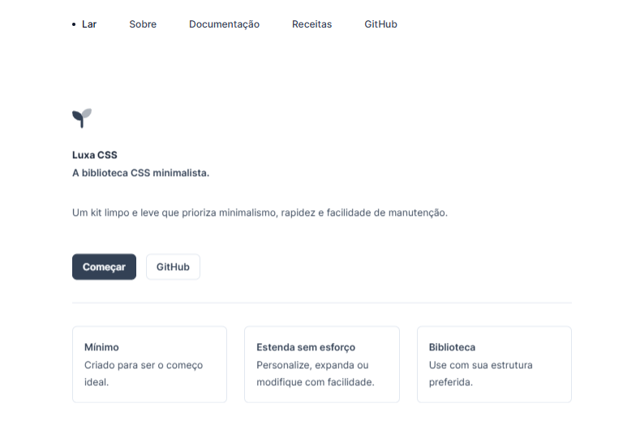

# Luxa CSS

___

Este repositório documenta o conjunto de testes que realizei no site [Luxa CSS](https://www.luxacss.com/), que é um projeto de código aberto dedicado à implementação de CSS acessível e design responsivo, promovendo boas práticas de acessibilidade para desenvolvedores e designers criarem interfaces responsivas e inclusivas. Meu objetivo foi garantir que a navegação, a usabilidade e a funcionalidade do site estivessem de acordo com os padrões de qualidade, proporcionando uma experiência consistente e acessível para os usuários em diversos dispositivos e navegadores. Neste projeto, trabalhei na verificação das funcionalidades essenciais, responsividade, acessibilidade, clareza da interface e navegação.

## Testes Realizados

### Testes de Navegação

- **Navegação Completa pelo Menu:** Testei cada item do menu principal (Home, About, Docs, Recipes e GitHub) para garantir que todos direcionassem corretamente para a página ou seção indicada.
- **Retorno à Página Inicial:** Verifiquei se o botão Home redirecionava o usuário de volta à página inicial de forma correta.
- **Navegação para "About" e Links Externos:** Validei o carregamento da seção "About" e testei links externos, como redes sociais e "Dracula Theme/Pro", para garantir que abrissem em novas abas.
- **Navegação para "Docs" e "Recipes":** Testei a navegação para as subcategorias da seção Docs e verifiquei o conteúdo carregado em Recipes.
- **Verificação de Redirecionamentos:** Acessei URLs inexistentes para garantir que o site exibisse uma página de erro personalizada ou uma mensagem 404.

### Testes de Funcionalidade

- **Botão "Get Started":** Testei o botão "Get Started" para garantir que ele redirecionasse corretamente para a seção de introdução.
- **Exibição e Cópia de Códigos de Exemplo:** Verifiquei a exibição dos exemplos de código CSS na seção Docs e validei a funcionalidade de cópia dos códigos.
- **Botão de Download do Luxa CSS:** Testei o download manual do arquivo Luxa CSS na seção "Installation" para confirmar que o arquivo baixava corretamente.

### Testes de Compatibilidade

- **Responsividade em Diferentes Dispositivos:** Acessei o site em smartphones, tablets e desktops para verificar se o layout se adaptava a cada tamanho de tela.
- **Compatibilidade com Navegadores Desktop e Mobile:** Testei o site nos navegadores Chrome e Firefox, tanto em desktop quanto em dispositivos móveis, para garantir que a formatação e a funcionalidade fossem consistentes.
- **Orientação de Tela em Dispositivos Móveis:** Alternei entre as orientações retrato e paisagem em dispositivos móveis, verificando se a visualização do layout permanecia estável.

### Testes de Acessibilidade

- **Navegação Completa via Teclado:** Testei a navegação pelo site usando apenas o teclado, confirmando que todas as áreas interativas fossem acessíveis e o foco estivesse em uma ordem lógica.
- **Navegação com Leitor de Tela:** Usei um leitor de tela para verificar se cada elemento e texto do site eram descritos corretamente.

### Testes de Usabilidade

- **Identificação e Clareza do Menu:** Inspecionei os rótulos do menu principal para garantir que cada item fosse identificável e apontasse para o conteúdo correto.
- **Feedback Visual para Download:** Testei o feedback visual do botão "Download Luxa CSS" para verificar se o site exibia uma confirmação ao iniciar o download.
- **Clareza e Consistência de Seções no Layout:** Naveguei por todas as seções, avaliando a clareza dos cabeçalhos e a consistência do layout.
- **Identificação Visual de Botões e Links:** Inspecionei botões e links para garantir que fossem visualmente distintos e intuitivos para incentivar a interação.

## Conclusão

Este projeto de testes do LUXACSS foi uma oportunidade para validar a navegação, usabilidade, compatibilidade e acessibilidade desse projeto de código aberto. Com um foco na experiência do usuário e na acessibilidade, garanti que o site proporcionasse uma navegação fluida e um layout responsivo, de acordo com a proposta do LUXACSS de promover CSS acessível e boas práticas de design.
